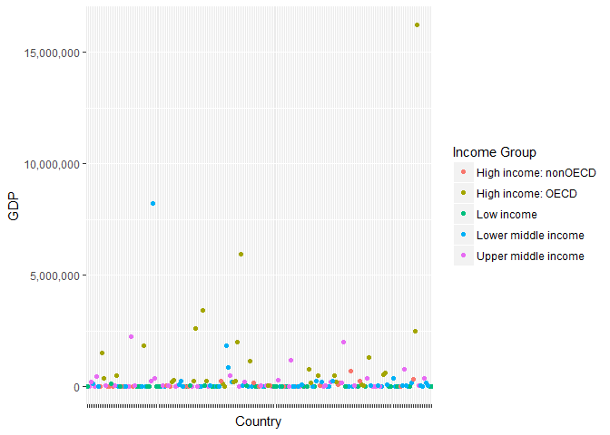

# GDP and Education data
Gerardo Garza  
March 21, 2017  


## Introduction
This document delineates the analysis performed on the data sets for the gross domestic product ranking table and the education statistics. Both are provided by the world bank.     
The GDP data was downloaded from : https://d396qusza40orc.cloudfront.net/getdata%2Fdata%2FGDP.csv.    
The Education data was obtained from: https://d396qusza40orc.cloudfront.net/getdata%2Fdata%2FEDSTATS_Country.csv.

The original data sources for the GDP and Education data are located respectively at:
http://data.worldbank.org/data-catalog/GDP-ranking-table
and
http://data.worldbank.org/data-catalog/ed-stats.

### Project Structure
The project contains 2 folders: Data and Analysis.  
The Data folder contains the code to download ("download.R") and to clean and merge the data ("cleanMerge.R").    
The Analysis folder contains both "Analysis.R" and "Plots.R", which are used to do all of the calculations, analyses, and to create the plots for this project.

```r
source("Data/downloadData.R")
```

```
## Downloading data from: https://d396qusza40orc.cloudfront.net/getdata%2Fdata%2FGDP.csv
```

```
## Specified SHA-1 hash matches downloaded data file.
```

```
## Downloading data from: https://d396qusza40orc.cloudfront.net/getdata%2Fdata%2FEDSTATS_Country.csv
```

```
## Specified SHA-1 hash matches downloaded data file.
```

```r
source("Data/cleanMerge.R")
```

```
## Warning: NAs introduced by coercion
```

```r
source("Analysis/Analysis.R")
source("Analysis/Plots.R")
```

The messages listed above should indicate the data was downloaded with a SHA-1 hash, which was used to make sure the data remains consistent.
Please note all of the NA's introduced by coercion were accounted for and cleaned during the analysis. Disregard the warning message.

## The Data
The data was initially downloaded and stored in 2 separate data frames: "GDP.Data" for the GDP Data and "Education.Data" for the Education data.    
After the data was cleaned and analyzed it was then stored in the data frames "newGDP" and "newEducation".

The initial data frames "GDP.Data" and "Education.Data" were not modified in order to maintain the original data from the download.

GDP.Data contains 330 records and 10 variables

```r
names(GDP.Data)
```

```
##  [1] "V1"                          "Gross domestic product 2012"
##  [3] "V3"                          "V4"                         
##  [5] "V5"                          "V6"                         
##  [7] "V7"                          "V8"                         
##  [9] "V9"                          "V10"
```

Education.Data contains 234 records and 31 variables.

```r
names(Education.Data)
```

```
##  [1] "CountryCode"                                      
##  [2] "Long Name"                                        
##  [3] "Income Group"                                     
##  [4] "Region"                                           
##  [5] "Lending category"                                 
##  [6] "Other groups"                                     
##  [7] "Currency Unit"                                    
##  [8] "Latest population census"                         
##  [9] "Latest household survey"                          
## [10] "Special Notes"                                    
## [11] "National accounts base year"                      
## [12] "National accounts reference year"                 
## [13] "System of National Accounts"                      
## [14] "SNA price valuation"                              
## [15] "Alternative conversion factor"                    
## [16] "PPP survey year"                                  
## [17] "Balance of Payments Manual in use"                
## [18] "External debt Reporting status"                   
## [19] "System of trade"                                  
## [20] "Government Accounting concept"                    
## [21] "IMF data dissemination standard"                  
## [22] "Source of most recent Income and expenditure data"
## [23] "Vital registration complete"                      
## [24] "Latest agricultural census"                       
## [25] "Latest industrial data"                           
## [26] "Latest trade data"                                
## [27] "Latest water withdrawal data"                     
## [28] "2-alpha code"                                     
## [29] "WB-2 code"                                        
## [30] "Table Name"                                       
## [31] "Short Name"
```


## Data Merge
To complete this analysis a merge between the Education data and the GDP data was necessary.   
After the data from "GDP.Data" and "Education.Data" were cleaned, they were merged into a new data frame called "mergedEducationGDP".
The merge was done by using CountryCode as the binding variable.     
The resulting records after the merge totaled 190 observations. One of the variables included an NA value, so it was removed. This left us with a total of 189 records. See below.

```r
dim(mergedEducationGDP)
```

```
## [1] 189   6
```

After the merge, only the variables that were pertaining to this analysis were kept.
The new data frame "mergedEducationGDP" contains the following:

```r
names(mergedEducationGDP)
```

```
## [1] "CountryCode"  "Ranking"      "Country"      "GDP"         
## [5] "Income Group" "RankGroup"
```

## Countries with a low Gross Domestic Product

The top 15 countries with the worse GDP are listed as follows:

```r
head(subset(mergedEducationGDP, select=c(CountryCode, Ranking, Country)),n=15)
```

```
##     CountryCode Ranking                        Country
## 215         TUV     190                         Tuvalu
## 108         KIR     189                       Kiribati
## 138         MHL     188               Marshall Islands
## 170         PLW     187                          Palau
## 196         STP     186          São Tomé and Principe
## 70          FSM     185          Micronesia, Fed. Sts.
## 211         TON     184                          Tonga
## 51          DMA     183                       Dominica
## 42          COM     182                        Comoros
## 230         WSM     181                          Samoa
## 223         VCT     180 St. Vincent and the Grenadines
## 80          GRD     178                        Grenada
## 109         KNA     178            St. Kitts and Nevis
## 227         VUT     177                        Vanuatu
## 77          GNB     176                  Guinea-Bissau
```
Based on this observation, we see St. Kitts and Nevis is the country with the 13th worse GDP.


##Average GDP rankings for High Income groups

The average GDP ranking for all high income groups (both OECD and nonOECD) is:

```r
mean(highIncome$Ranking)
```

```
## [1] 58.54717
```
The average ranking for only the "High income: OECD" is:

```r
mean(OECD$Ranking)
```

```
## [1] 32.96667
```
And the average ranking for only the "High income: nonOECD" is

```r
mean(noOECD$Ranking)
```

```
## [1] 91.91304
```

This analysis shows there is a big difference in GDP rankings between these 2 groups.     
Even though they are both on the "High income" group, the nonOECD group has a much lower mean ranking (greater GDP).


## Distribution of GDP for all countries
The distribution of GDP for all countries based on their Income Group is as follows:

```r
PlotAllCountries
```

<!-- -->

This plot shows the overall distribution of GDP in all the countries in this analysis. There are only 3 above the 5,000,000 B in GDP mark, and most of the countries' GDP is too low in comparison those 3 to be able to obtain any clear data from this plot.


### GDP distribution for all countries in their respective income group

```r
PlotAllCountriesbyIGroup
```

<!-- -->

The results on this graph show that the GDP distribution for the 'High income:nonOECD' group is actually closer to the 'Low income' group than it is to the other high income group (OECD). In fact, the country with the highest GDP in the nonOECD group does not go beyond 720,000B. In addition, the only other income group that has countries with this low GDP value are in the 'Low income' group. The results also show that the country with the highest GDP in the Lower middle income group is actually higher than all the countries, except for the Higher income OECD group.

## Summary of statistics of GDP by income groups

```r
tapply(mergedEducationGDP$GDP, mergedEducationGDP$`Income Group`, summary)
```

```
## $`High income: nonOECD`
##    Min. 1st Qu.  Median    Mean 3rd Qu.    Max. 
##    2584   12840   28370  104300  131200  711000 
## 
## $`High income: OECD`
##     Min.  1st Qu.   Median     Mean  3rd Qu.     Max. 
##    13580   211100   486500  1484000  1480000 16240000 
## 
## $`Low income`
##    Min. 1st Qu.  Median    Mean 3rd Qu.    Max. 
##     596    3814    7843   14410   17200  116400 
## 
## $`Lower middle income`
##    Min. 1st Qu.  Median    Mean 3rd Qu.    Max. 
##      40    2549   24270  256700   81450 8227000 
## 
## $`Upper middle income`
##    Min. 1st Qu.  Median    Mean 3rd Qu.    Max. 
##     228    9613   42940  231800  205800 2253000
```

```r
tapply(mergedEducationGDP$GDP, mergedEducationGDP$`Income Group`, sd)
```

```
## High income: nonOECD    High income: OECD           Low income 
##            165334.45           3070463.52             20473.09 
##  Lower middle income  Upper middle income 
##           1139619.92            476872.04
```

Based on these results, we can see that the distribution on each group is not evenly distributed. Based on these results, the distribution appears to be right skewed. There is a large range between the minimun and maximum values, and we can suspect there are outliers pulling the distribution. This is even more apparent on the High income: OECD group and the Lower middle income group.


## GDP rankings divided into 5 quantile groups compared to each Income group.

```r
tablebyRankGroup
```

```
##          
##           High income: nonOECD High income: OECD Low income
##   Group 1                    4                18          0
##   Group 2                    5                10          1
##   Group 3                    8                 1          9
##   Group 4                    4                 1         16
##   Group 5                    2                 0         11
##          
##           Lower middle income Upper middle income
##   Group 1                   5                  11
##   Group 2                  13                   9
##   Group 3                  12                   8
##   Group 4                   8                   8
##   Group 5                  16                   9
```

In this table, we can see there are no Low income countries in group 1, which can be expected because it could be perceived that low income countries would not have a high GDP. However,  we see that the Lower middle income group has 5 countries that are among the group of nations with the highest GDP. This group has 1 more country than the High income:nonOECD group.

## Conclusion
The results from this data show that the distribution of GDP among the countries is simliar for each income group. There are a few countries that have an extreme high GDP. Whereas, the majority of countries have a lower GDP in comparison.  We see that there is very little, if any, correlation between the income group and GDP. In other words, a higher income may not be equal to a higher GDP value. Because of the extreme values in each group, it is difficult to make an accurate comparison between the countries based on their income group. If there was more information about how the countries were grouped, we could better understand why there are those extremes. Without these outliers we could more accurately compare the countries in each group. 
